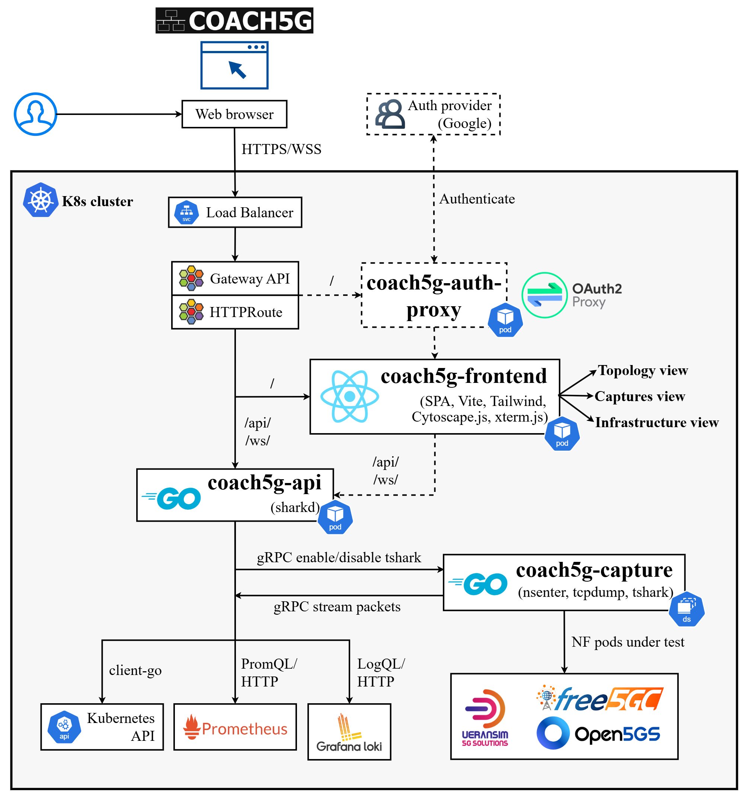

# COACH5G

A web-based observability and control platform for cloud-native 5G Standalone testbeds on Kubernetes, unifying network function topology, live packet capture, and infrastructure monitoring behind a single browser interface. Validated across two independent 5G core implementations, free5GC (ULCL) and Open5GS (single-UPF), on the same testbed deployed over Proxmox with Cilium, Multus, and a Prometheus-Grafana-Loki observability stack.

<p align="center">
  
</p>

## Overview

COACH5G is built as three components, each with its own responsibility: **coach5g-api**, a Go backend that discovers and classifies network functions, proxies logs and metrics, and relays live capture data; **coach5g-capture**, a DaemonSet that attaches directly to a target pod's network interface and streams traffic to coach5g-api over gRPC; and **coach5g-frontend**, a React single-page application presenting the topology, capture, and infrastructure views. A small set of optional add-ons, encryption on the internal gRPC channel, Google-authenticated access via coach5g-auth-proxy, and remote pod access, extend the platform without changing its default behavior.

## Demo

**free5GC (ULCL)**

[](https://youtu.be/OyHG1WxrTP0)

**Open5GS**

[](https://youtu.be/drQQrLlNMXg)

## Key Results

| Evaluation | Result |
|---|---|
| Portability | Topology discovery, live capture, and infrastructure monitoring all confirmed working against both free5GC and Open5GS deployments |
| Resource overhead | Combined coach5g-api/coach5g-capture footprint stays under 750 MiB of memory and a few millicores of CPU, even with 8 simultaneous capture tabs |
| Diagnostic efficiency | 56% average reduction in the number of actions required for common diagnostic tasks, compared with equivalent command-line workflows |

Full experimental results, benchmark scripts, and raw measurement data are in [docs/evaluation](docs/evaluation).

## Quick Start

Deployment is documented step by step in [docs/deployment-guide](docs/deployment-guide):

1. [Requirements](docs/deployment-guide/01-requirements.md)
2. [Installation — Cilium Gateway](docs/deployment-guide/02-installation-cilium.md)
3. [Installation — Generic Gateway API](docs/deployment-guide/03-installation-generic-gateway.md)
4. [Installation — No Gateway API](docs/deployment-guide/04-installation-no-gateway-api.md)
5. [Troubleshooting Portability](docs/deployment-guide/05-troubleshooting-portability.md)

## Software Stack

```
COACH5G
├── Go: 1.25.0 (api-server), 1.23.0 (capture-agent)
├── React: 19 (Vite, Tailwind CSS, Cytoscape.js, xterm.js)
└── Packaging: Helm, Cilium Gateway API

Validated Testbed
├── Kubernetes: 1.35.4 (kubeadm)
├── Cilium: 1.19.3 · Multus: 4.2.4 · Gateway API: v1.4.1
├── Longhorn: 1.11.2
├── kube-prometheus-stack: 85.0.3 · Loki: 3.7.2
├── free5GC: v4.2.2 · UERANSIM: v4.0.1
└── Open5GS: v2.7.5 · UERANSIM: v3.2.6
```

> COACH5G is designed to be agnostic to the underlying testbed. The Validated Testbed above is documented in full in [5gc-cloudnative-testbed](https://github.com/lpoclin/5gc-cloudnative-testbed), reproducible from scratch if you don't have one of your own.

## Repository Structure

```
coach5g/
├── api-server/
├── capture-agent/
├── frontend/
├── helm/
├── docs/
│   ├── deployment-guide/
│   └── evaluation/
│       ├── 01-portability/
│       ├── 02-resource-overhead/
│       └── 03-diagnostic-efficiency/
├── LICENSE
└── README.md
```

## Affiliation


Faculty of Electronic and Electrical Engineering, Universidad Nacional Mayor de San Marcos, Lima, Peru.

## License

This project is licensed under the MIT License, allowing free use, modification, and redistribution for academic and non-academic purposes, with attribution. See [LICENSE](LICENSE) for details.
