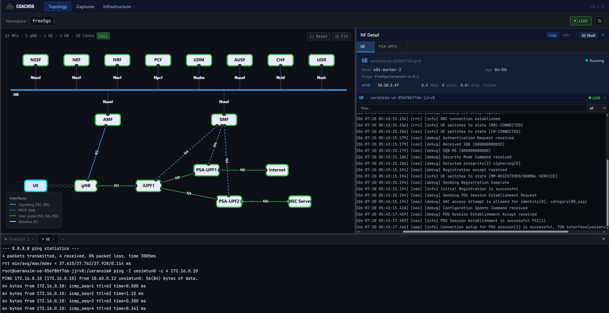
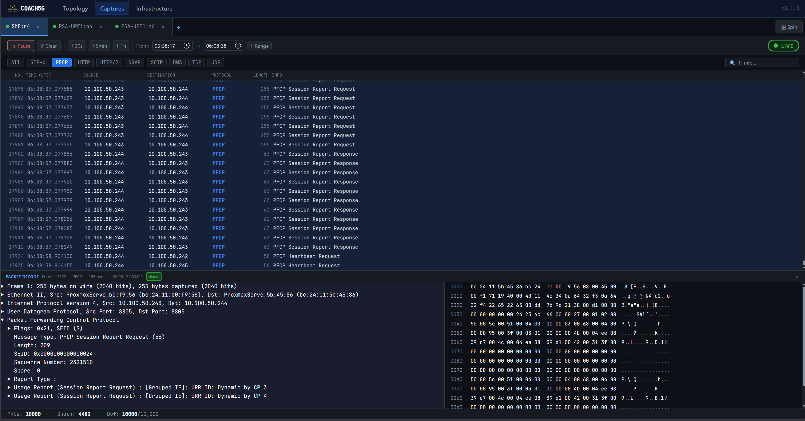
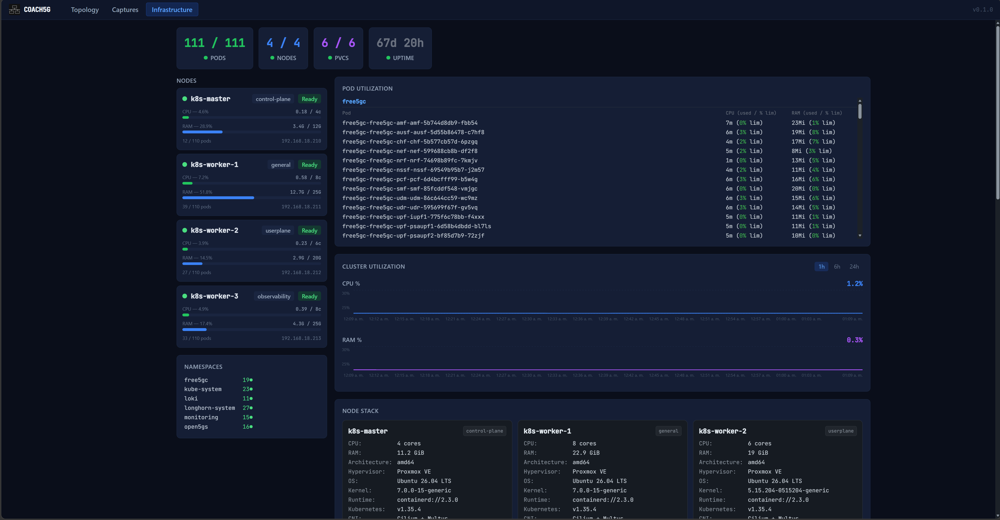
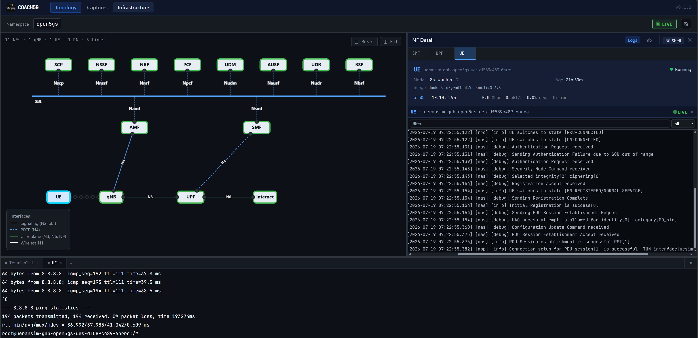
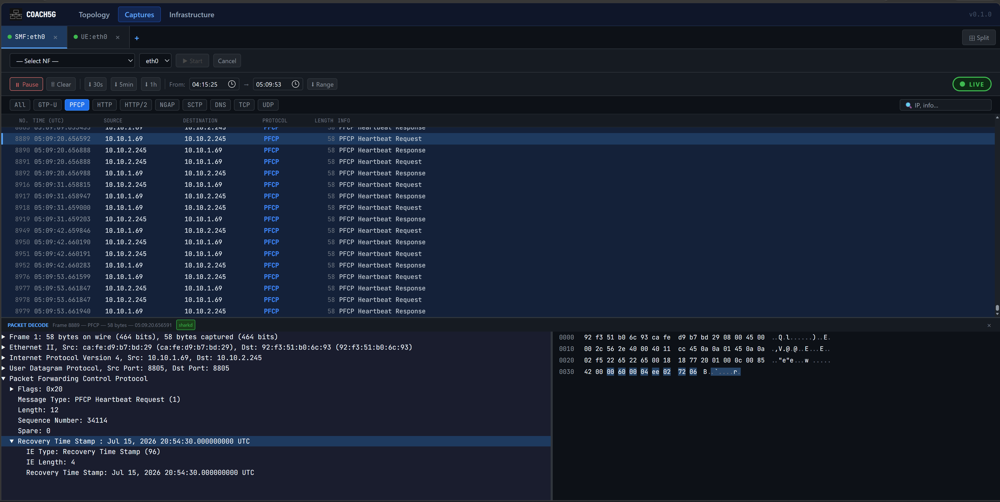
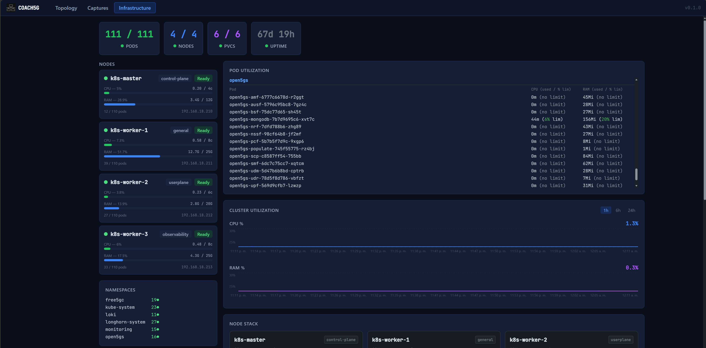

# Portability and Functionality

Evidence for Section IV.A of the paper: the same COACH5G deployment, switched between free5GC (ULCL) and Open5GS by changing only two Helm values, `coreProfile` and `targets[0].namespace`.

## Methodology

Portability and functionality were validated by deploying the same COACH5G build against two independent 5G core deployments, free5GC in a ULCL topology and Open5GS in a single-UPF topology, and confirming that topology discovery, live packet capture, and infrastructure monitoring all operate correctly in both, with no code changes between the two.

## Install Modes

Switching between the two looks like this:

```bash
# free5GC
cd ~/coach5g
helm upgrade coach5g ./helm \
  --set 'allowedOrigins={http://192.168.18.234,http://coach5g.duckdns.org}' \
  --set execTerminal.enabled=true \
  --set 'targets[0].namespace=free5gc' \
  --set 'targets[0].dnnMap.psaupf1=internet' \
  --set 'targets[0].dnnMap.psaupf2=MEC Server' \
  --set gateway.hostname=coach5g.duckdns.org \
  --set auth.oauth2Proxy.enabled=true \
  --set auth.oauth2Proxy.redirectURL=http://coach5g.duckdns.org/oauth2/callback \
  --set 'auth.oauth2Proxy.emailDomains={unmsm.edu.pe}' \
  --set 'auth.oauth2Proxy.signIn.logoPath=/etc/coach5g/logo/logo.svg' \
  --set 'auth.oauth2Proxy.signIn.banner=-' \
  --set coreProfile=free5gc
```

```bash
# Open5GS
cd ~/coach5g
helm upgrade coach5g ./helm \
  --set 'allowedOrigins={http://192.168.18.234,http://coach5g.duckdns.org}' \
  --set execTerminal.enabled=true \
  --set 'targets[0].namespace=open5gs' \
  --set gateway.hostname=coach5g.duckdns.org \
  --set auth.oauth2Proxy.enabled=true \
  --set auth.oauth2Proxy.redirectURL=http://coach5g.duckdns.org/oauth2/callback \
  --set 'auth.oauth2Proxy.emailDomains={unmsm.edu.pe}' \
  --set 'auth.oauth2Proxy.signIn.logoPath=/etc/coach5g/logo/logo.svg' \
  --set 'auth.oauth2Proxy.signIn.banner=-' \
  --set coreProfile=open5gs
```

Most of these flags are unrelated to portability. `allowedOrigins`, `execTerminal.enabled`, `gateway.hostname`, and the `auth.oauth2Proxy.*` block configure the hub's authentication and terminal access, and stay the same in both commands. The only two values that actually change are `targets[0].namespace`, which namespace to discover pods in, and `coreProfile`, which core to interpret them as. `targets[0].dnnMap` is specific to free5GC's UPF naming and has no effect under `coreProfile=open5gs`.

## How This Works

COACH5G queries the Kubernetes API for the pods in the target namespace, works out what network function each one is, and builds the topology from that. It's designed to be agnostic to which core is running underneath. Which core it expects is set once, at deploy time, through the `coreProfile` value in the commands above, and from there it automatically discovers and classifies whatever network functions are actually running in the namespace named in `targets[0].namespace`.

### Technical Detail

In practice, this happens in two steps: first it finds every pod in that target namespace through the Kubernetes API, with no core-specific logic involved, then it works out what each one actually is behind a `CoreProfile` interface, which `Free5GCProfile` and `Open5GSProfile` each implement on their own. For most network functions this second step is simple: both profiles read one label off the pod, `app.kubernetes.io/component` for free5GC, `app.kubernetes.io/name` for Open5GS, and match it to a known NF type. The one exception is free5GC's UPF instances: in a ULCL deployment there are three of them, BranchingUPF, AnchorUPF1, AnchorUPF2, all sharing the same component label, so `Free5GCProfile` falls back to a second, more specific label, `nf`, just for those pods, to tell them apart. Open5GS's single UPF never needs this, since `app.kubernetes.io/name` already identifies it on its own.

The infrastructure and capture views don't rely on any of this classification. They read cluster state, metrics, and packet data straight from Kubernetes, Prometheus, and Loki, so they work the same way no matter which core is running, or whether a `CoreProfile` is involved at all. That narrow scope is also what makes a future third core easy to add: writing the three `CoreProfile` methods for its labels is the only change needed, since nothing else in the platform reads from them.

## free5GC (ULCL)

[](https://youtu.be/OyHG1WxrTP0)
[](https://youtu.be/OyHG1WxrTP0)

**Topology view** — three UPF instances (BranchingUPF, AnchorUPF1, AnchorUPF2) correctly discovered and classified.



**Capture view** — live traffic decoded on a free5GC interface.



**Infrastructure view** — cluster state for the free5GC namespace.



## Open5GS

[](https://youtu.be/drQQrLlNMXg)
[](https://youtu.be/drQQrLlNMXg)

**Topology view** — Open5GS's single-UPF deployment, gNB and UE registered and exchanging live traffic.



**Capture view** — live traffic decoded on an Open5GS interface.



**Infrastructure view** — cluster state for the Open5GS namespace.



---

These correspond to Fig. 2–5 in the paper.

---

✅ You are here: `evaluation / 01-portability`
⏭️ Next: [02 — Resource Overhead →](../02-resource-overhead/README.md)
