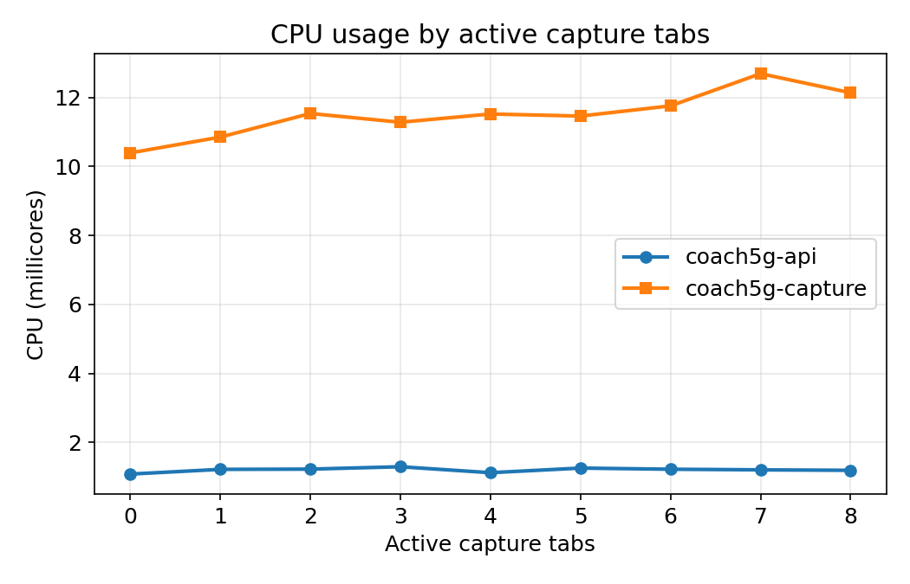
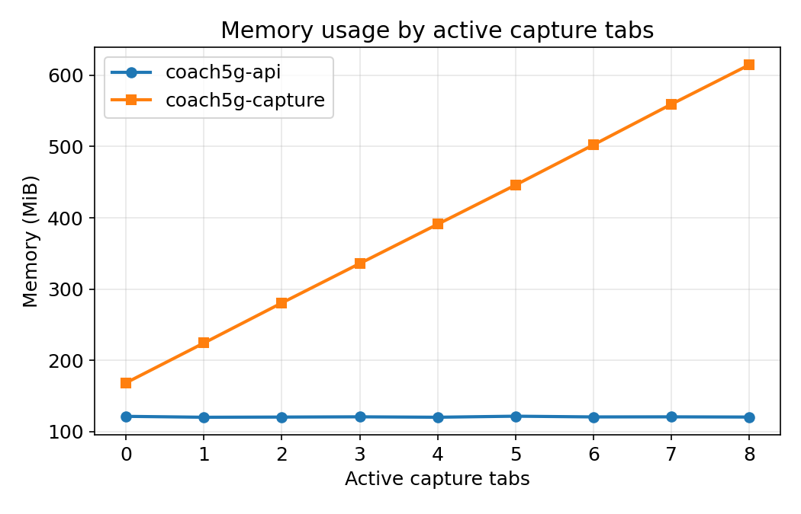

# Resource Overhead

Evidence for Section IV.B of the paper: coach5g-api and coach5g-capture CPU and memory, measured across 0 to 8 simultaneous live capture tabs.

## Methodology

To measure this overhead, the underlying 5G deployment was kept idle, with a UE registered but generating only control-plane signaling, isolating the platform's own cost from traffic-dependent variation. coach5g-frontend just renders what the browser already has, so the measurement focuses on coach5g-api and coach5g-capture instead. Live capture tabs were the scenario swept because each one spins up its own tshark process, the one feature whose cost actually scales with concurrent use, unlike the topology or infrastructure views. A script opened 0 to 8 simultaneous tabs, sampling CPU and memory from Prometheus over a 120-second window at each level.

## Reproducing This

The benchmark script opens its own port-forward to coach5g-api, sweeps through all 9 levels automatically, and writes results to CSV after every level:

```bash
python3 scripts/coach5g_overhead_benchmark.py --out coach5g_overhead.csv
```

Full script: [scripts/coach5g_overhead_benchmark.py](scripts/coach5g_overhead_benchmark.py). Raw output: [coach5g_overhead.csv](coach5g_overhead.csv).

## Results

The paper's Table II reports levels 0, 1, 4, and 8. The full sweep:

| Active tabs | coach5g-api CPU (m) | coach5g-api RAM (MiB) | coach5g-capture CPU (m) | coach5g-capture RAM (MiB) |
|---|---|---|---|---|
| 0 | 1.1 | 121.5 | 10.4 | 168.5 |
| 1 | 1.2 | 120.2 | 10.9 | 224.4 |
| 2 | 1.2 | 120.5 | 11.5 | 280.6 |
| 3 | 1.3 | 120.8 | 11.3 | 335.9 |
| 4 | 1.1 | 120.2 | 11.5 | 391.0 |
| 5 | 1.3 | 121.7 | 11.5 | 446.0 |
| 6 | 1.2 | 120.7 | 11.8 | 502.4 |
| 7 | 1.2 | 120.8 | 12.7 | 559.3 |
| 8 | 1.2 | 120.5 | 12.1 | 614.6 |





coach5g-api stays essentially flat across the whole sweep. coach5g-capture's CPU stays low too, but its memory grows in an almost straight line, about 55–57 MiB per tab, matching a dedicated tshark process spun up for each newly opened interface. At 8 tabs, coach5g-api and coach5g-capture together use 735.1 MiB, staying under the 750 MiB the paper reports.

## Reproducing This on a Different Cluster

The script's defaults, the Prometheus URL and the coach5g-api Service name and namespace, are specific to this exact testbed and aren't secrets, just fixed values for one cluster. Running it elsewhere means passing `--prom-base`, `--namespace`, or the other CLI flags for that cluster instead of relying on the defaults.


---

✅ You are here: `evaluation / 02-resource-overhead`
⏭️ Next: [03 — Diagnostic Efficiency →](../03-diagnostic-efficiency/README.md)
