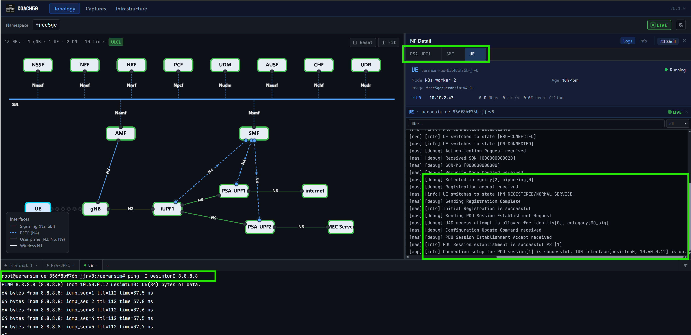
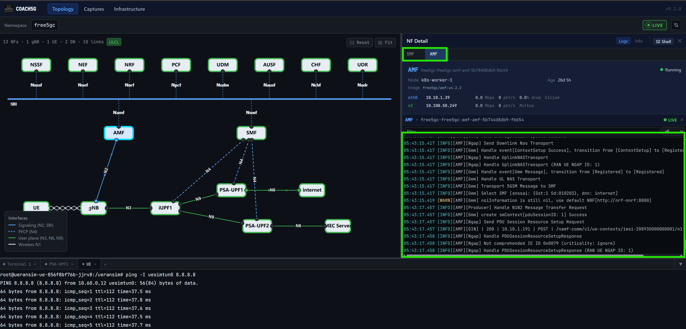
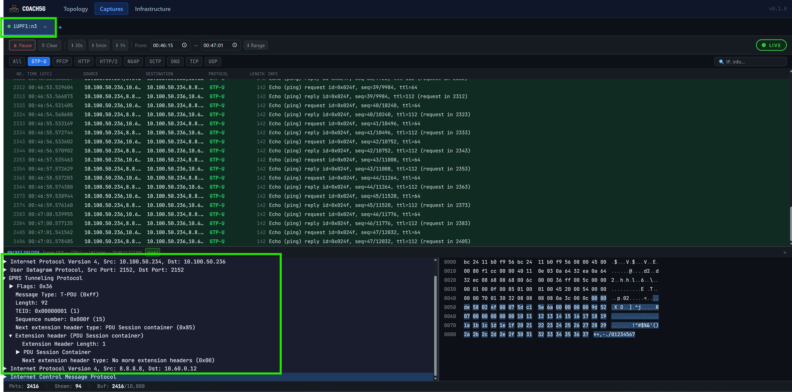
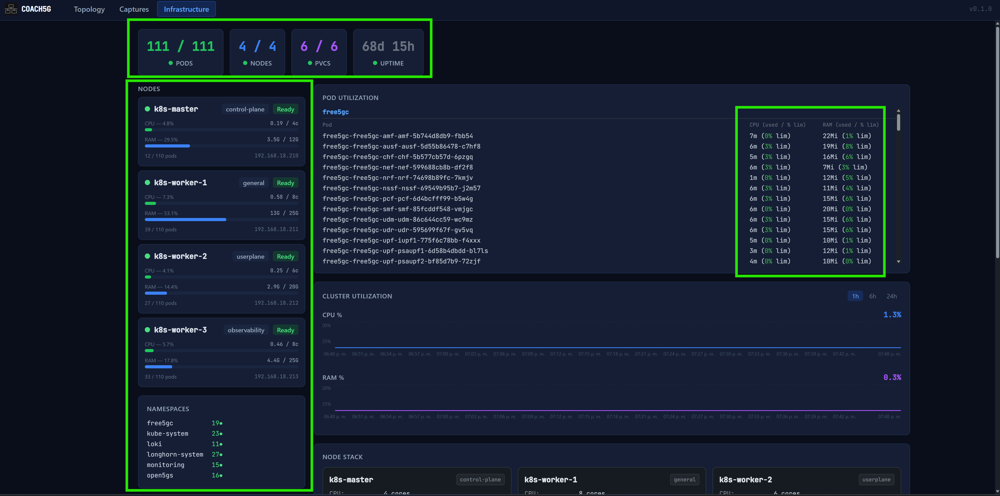
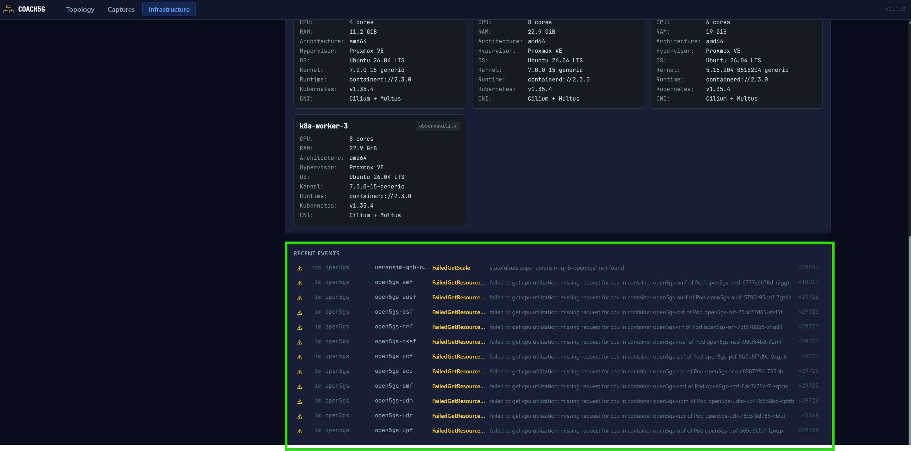

# Diagnostic Efficiency

Evidence for Section IV.C of the paper: the number of actions needed to complete five common diagnostic tasks, command line versus COACH5G.

## Methodology

Diagnostic efficiency is compared against the kind of command sequence a typical Kubernetes or 5G core troubleshooting guide would walk an operator through: general commands for a representative task, not something pulled from one specific incident, since the goal is to reflect ordinary practice, not a worst case. Each step is counted the same simple way on both sides, one CLI step is a single terminal or external tool interaction, and one COACH5G step is a single click, hover, or typed entry. This only counts actions, not how long each one takes or how much thought it requires, so a click isn't being claimed to cost the same effort as typing a full command, just that both count as one step. The exact sequence behind every task, commands and clicks alike, is laid out below.

## Results

| No. | Task | CLI steps | COACH5G steps | Reduction |
|---|---|---|---|---|
| 1 | Verify active UE session | 6 | 5 (4 clicks + 1 typed) | 17% |
| 2 | Inspect control-plane signaling | 3 | 2 clicks | 33% |
| 3 | Decode user-plane traffic | 6 | 2 (1 hover + 1 click) | 67% |
| 4 | Check infrastructure state | 6 | 1 click | 83% |
| 5 | Diagnose failing pod (pod-level scope) | 5 | 2 clicks | 60% |
| | **Average** | | | **52%** |

## Task 1: Verify Active UE Session

**CLI (6 steps)**
```bash
kubectl get pods -A
kubectl logs ueransim-ue-856f8bf76b-jjrv8 -n free5gc
kubectl exec -it ueransim-ue-856f8bf76b-jjrv8 -n free5gc -- ip a
ping 8.8.8.8
kubectl logs free5gc-free5gc-smf-smf-85fcddf548-vmjgc -n free5gc
kubectl logs free5gc-free5gc-upf-iupf1-775f6c78bb-f4xxx -n free5gc
```

**COACH5G (5 steps)**
1. Click the UE node
2. Click "Open Shell"
3. Type `ping 8.8.8.8`
4. Click the SMF node
5. Click the UPF node


<sub>Figure 1. UE node side panel, with shell open and SMF/UPF reachable from the same graph.</sub>
<br><br>

## Task 2: Inspect Control-Plane Signaling

**CLI (3 steps)**
```bash
kubectl get pods -A
kubectl logs free5gc-free5gc-amf-amf-5b744d8db9-fbb54 -n free5gc
kubectl logs free5gc-free5gc-smf-smf-85fcddf548-vmjgc -n free5gc
```

**COACH5G (2 steps)**
1. Click the AMF node
2. Click the SMF node


<sub>Figure 2. AMF and SMF logs, opened directly from the topology graph.</sub>
<br><br>

## Task 3: Decode User-Plane Traffic

**CLI (6 steps)**
```bash
kubectl get pods -A
kubectl exec -it free5gc-free5gc-upf-iupf1-775f6c78bb-f4xxx -n free5gc -- bash
apt-get update && apt-get install -y tcpdump
tcpdump -i n3 -w capture.pcap
kubectl cp free5gc/free5gc-free5gc-upf-iupf1-775f6c78bb-f4xxx:capture.pcap ./capture.pcap
wireshark capture.pcap
```

**COACH5G (2 steps)**
1. Hover the interface dot on the target node
2. Click "Live Capture"


<sub>Figure 3. Live GTP-U decoding, started from a single hover and click.</sub>
<br><br>

## Task 4: Check Infrastructure State

**CLI (6 steps)**
```bash
kubectl get svc -n monitoring
kubectl port-forward -n monitoring svc/kube-prometheus-stack-grafana 3000:80
# open Grafana at localhost:3000, create a dashboard
# create a panel
# write the PromQL query
# view the result
```

**COACH5G (1 step)**
1. Click the Infrastructure tab


<sub>Figure 4. Cluster resource state, populated on tab load.</sub>
<br><br>

## Task 5: Diagnose a Failing Pod

**CLI (5 steps, pod-level scope)**
```bash
kubectl get pods -A
kubectl describe pod free5gc-free5gc-pcf-pcf-6d4bcfff99-b5w4g -n free5gc
kubectl get events -n free5gc
kubectl logs free5gc-free5gc-pcf-pcf-6d4bcfff99-b5w4g -n free5gc
kubectl logs free5gc-free5gc-pcf-pcf-6d4bcfff99-b5w4g -n free5gc --previous
```

**COACH5G (2 steps)**
1. Click the node already flagged with an error state
2. Click the Infrastructure tab to check node-level events


<sub>Figure 5. A CrashLoopBackOff pod, already flagged on the graph before any click.</sub>
<br><br>

---

✅ You are here: `evaluation / 03-diagnostic-efficiency`
